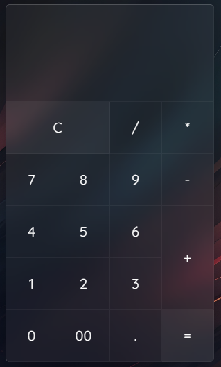

# Calculadora 🧮

## Descripción
Este es un proyecto básico de calculadora desarrollado con HTML, CSS y JavaScript. La calculadora permite realizar operaciones aritméticas simples, como suma, resta, multiplicación y división. El diseño es minimalista y funcional, ideal para quienes están aprendiendo a manipular el DOM con JavaScript y crear interfaces de usuario responsivas con CSS.

## Propósito del Proyecto
El propósito de este proyecto es aplicar conocimientos básicos de:

HTML para la estructura de la calculadora.
CSS para diseñar la interfaz de la calculadora y hacerla atractiva y funcional.
JavaScript para agregar la funcionalidad interactiva, como el manejo de eventos de clic y la lógica de las operaciones matemáticas.

### Funcionamiento
- Interfaz de Usuario: La calculadora tiene botones para los números del 0 al 9, las operaciones de suma (+), resta (-), multiplicación (*), división (/) y un botón igual (=) para mostrar el resultado.

- Operaciones Matemáticas: Al hacer clic en los números y operaciones, los valores se muestran en la pantalla de la calculadora. Cuando se presiona el botón "=", la calculadora evalúa la expresión y muestra el resultado.

- Reinicio de la Calculadora: La calculadora tiene un botón de "C" que borra la pantalla y reinicia la operación actual.

Muestra:

