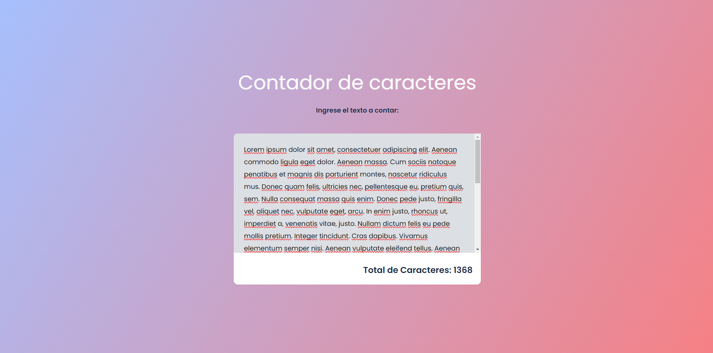

# Proyecto Contador de Caracteres

Proyecto sencillo hecho con Html, css y JavaScript para practicar algunos conceptos de diseño y demas cosas

El programa es muy sencillo, consiste en un espacio de texto en donde se puede escribir texto y se te mostrara en pantalla el numero de caracteres que contiene el texto que escribistes, y eso esto.

Imagen de Referencia:
