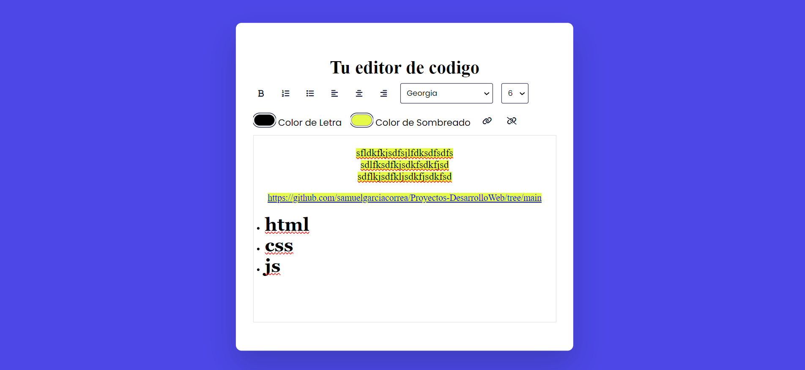

# Proyecto Editor de Texto

Este es un editor de texto simple, hecho con HTML, CSS y JavaScript, que permite aplicar varias opciones de formato de texto, incluyendo negrita, listas, alineaciones, cambios de fuente, tamaño, color de texto, fondo, y la posibilidad de agregar enlaces.

## Características

- **Negrita**: Permite al usuario aplicar estilo en negrita al texto.
- **Listas**: Opción para listas ordenadas (numeradas) y no ordenadas (viñetas).
- **Alineación de texto**: Alinear texto a la izquierda, centrado o a la derecha.
- **Cambio de fuente**: Selección de diferentes tipos de fuentes.
- **Tamaño de fuente**: Selección de varios tamaños de texto.
- **Colores**: Cambia el color del texto y el fondo del texto.
- **Enlaces**: Inserción de enlaces y eliminación de los mismos.

## Estructura del Proyecto

El proyecto está dividido en los siguientes archivos:

- **index.html**: Contiene la estructura del editor de texto.
- **styles.css**: Archivo de estilos que controla la apariencia del editor.
- **index.js**: Archivo JavaScript que controla la lógica y la interacción con el usuario.

************

# Imagen de muestra

