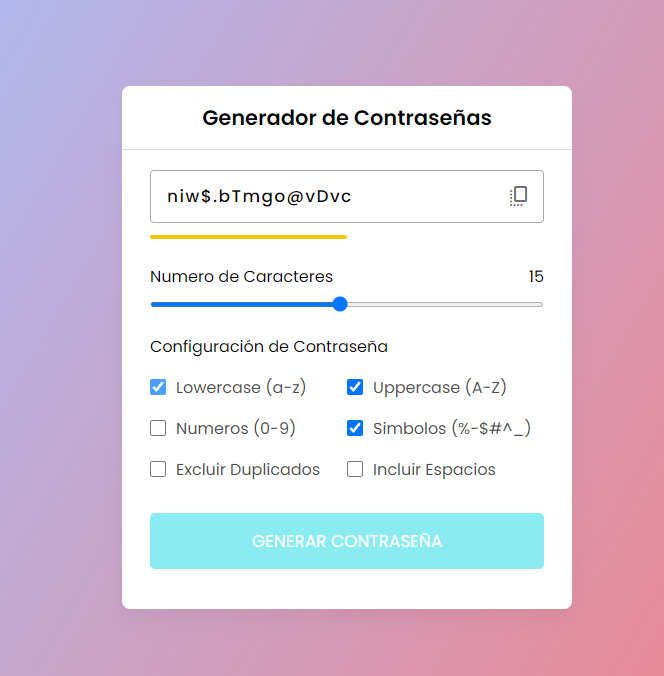

# Proyecto Generador de Contraseñas

Proyecto sencillo hecho con Html, css y JavaScript para practicar algunos conceptos que he ido aprendiendo en la marcha

El programa tiene un funcionamiento simple, consiste en Generador de Contraseñas en donde tienes varias opciones para la Contraseña como longitud, si quieres con mayusculas, minusculas, numeros, simbolos, espacios, etc. 
Entonces seleccionas la configuracion y longitud que quieras para tu Contraseña y el das generar y en el cuadro con texto te saldra la Contraseña generada, la cual tienes un boton para copiarla en tu porta papeles.

Imagen de Referencia:

