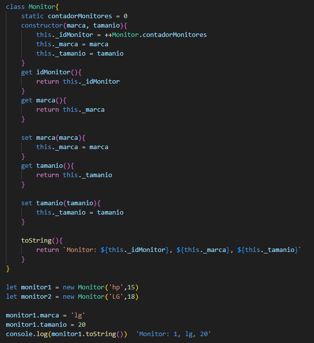

# Proyecto Practica Poo

es un proyecto creado para practicar conceptos como clases, constructores, atributos, herencia, polimorfismo y demas en el lenguaje de JavaScrip.

el programa funciona todo por consola y se crean los objetos para que se impriman por consola, por lo cual se usa la extension de visual studio Quokka para poder visualizar mejor las salidas del programa como lo vemos en las fotos

El programa consisten en 5 clases:

1. Clase Entrada:

2. Clase Raton:

en la ultima linea se ve la salida del metodo to string para le objeto raton2

*****

3. Clase monitor:
 

4. Clase Computadora:

5. Clase Orden:

*****
### Resultado final en la consola 
Al imprimir lo que tiene la orden 1 y agregarle mas computadora nos da:

