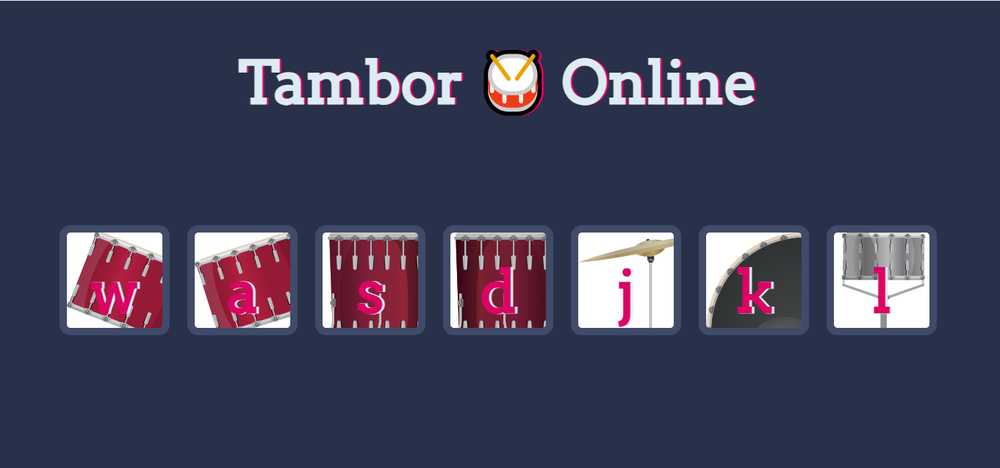

# Tambor Online 🥁
## Descripción
Este proyecto es una página interactiva de batería virtual, donde los usuarios pueden hacer clic en los botones correspondientes o presionar teclas en su teclado para reproducir diferentes sonidos de percusión. El objetivo es proporcionar una experiencia divertida y dinámica de tocar la batería utilizando el navegador web.

Cada tecla de la batería está representada por una letra (w, a, s, d, j, k, l), y al presionar cualquiera de esas teclas (ya sea en el teclado o al hacer clic en el botón correspondiente en la página), se reproducirá un sonido de tambor o platillo asociado.

## Propósito del Proyecto
El propósito de este proyecto es ilustrar cómo manejar eventos de interacción del usuario, como clics y pulsaciones de teclas, en una página web utilizando JavaScript. Este proyecto es adecuado para aquellos que deseen aprender o practicar:

Manejo de eventos de clic y teclado en JavaScript.
Manipulación del DOM para reproducir sonidos y aplicar animaciones.
Uso de CSS para agregar estilos y efectos visuales.
Control de flujos condicionales con switch en JavaScript.

## Funcionamiento
Interacción con el teclado: Presiona cualquier tecla asignada a la batería (w, a, s, d, j, k, l) para escuchar el sonido correspondiente.
Interacción con el mouse: Haz clic en cualquiera de los botones con las letras en la pantalla para reproducir el mismo sonido.

Efectos visuales: Cada vez que se presiona una tecla o se hace clic en un botón, el botón correspondiente muestra una breve animación (cambia de estilo) para indicar la acción.
Mapeo de teclas a sonidos:

w: Tom 1
a: Tom 2
s: Tom 3
d: Tom 4
j: Crash
k: Kick-bass
l: Snare

### Tecnologías Utilizadas
HTML5: Para la estructura y disposición de la página.
CSS3: Para estilizar la página, los botones de batería, y agregar animaciones.
JavaScript (ES6): Para manejar los eventos de teclado y clics, reproducir sonidos y activar efectos visuales.
Cómo Usar

#### Abrir el archivo: Abre el archivo index.html en tu navegador.
Interacción:
Presiona cualquiera de las teclas asignadas (w, a, s, d, j, k, l) para reproducir el sonido del tambor correspondiente.
Haz clic en cualquiera de los botones en la pantalla para lograr el mismo resultado.

Ejemplo:
